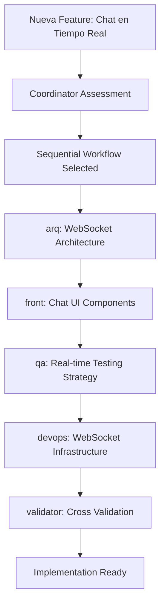
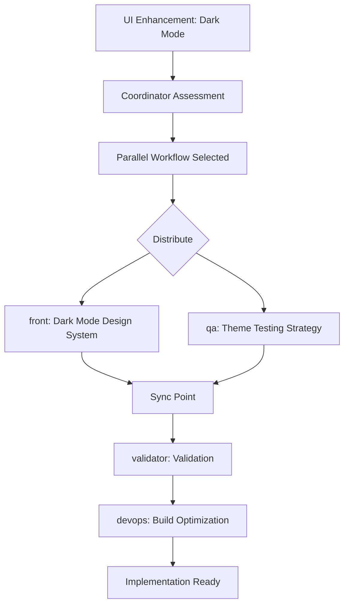
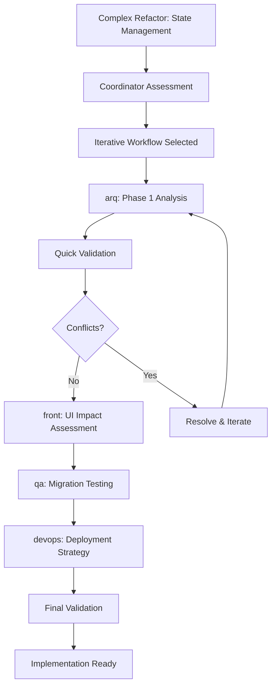

# 🚀 Multi-Agent System Implementation Guide

## 📋 Todo List - Sistema Multi-Agente V2.0

### ✅ Fase 1: Foundation & Coordination (COMPLETADA)
- [x] Implementar Coordinator Agent (coord.md)
- [x] Definir contratos de interface (contracts.md) 
- [x] Crear templates de handoff en contracts
- [x] Establecer workflow básico (workflows.md)
- [x] Mejorar agentes existentes (arq v2.0, front v2.0, qa v2.0)
- [x] Añadir DevOps Agent (devops.md)
- [x] Implementar Validator Agent (validator.md)
- [x] Crear documentación de sistema (README.md)

### 🔄 Fase 2: Integration & Automation (EN PROGRESO)
- [ ] Crear agente de Performance (perf.md)
- [ ] Crear agente de Security (security.md)  
- [ ] Implementar automation de workflows
- [ ] Configurar metrics y monitoring
- [ ] Crear integration tests para agentes
- [ ] Documentar casos de uso específicos

### 📅 Fase 3: Advanced Features (PLANIFICADA)
- [ ] AI-powered conflict resolution
- [ ] Predictive quality assessment
- [ ] Automated workflow optimization
- [ ] Advanced reporting y analytics
- [ ] External tool integrations (Jira, Figma, Slack)

## 🎯 Sistema Implementado

### **Agentes Core (Enhanced v2.0)**
1. **Architecture Agent (arq)** - Enhanced con dependency analysis, performance constraints, migration strategies
2. **Frontend Agent (front)** - Enhanced con component library audit, performance-oriented design
3. **QA Agent (qa)** - Enhanced con risk-based testing, non-functional testing, automation strategy

### **Agentes de Coordinación (New v1.0)**  
4. **Coordinator Agent (coord)** - Orquesta workflows, resuelve conflictos, mantiene coherencia
5. **Validator Agent (validator)** - Valida coherencia entre outputs, detecta inconsistencias
6. **DevOps Agent (devops)** - CI/CD, infraestructura, monitoring, deployment strategies

### **Sistema de Contratos**
- **Interface Contracts** - Define inputs, outputs, handoffs entre agentes
- **Validation Rules** - Criterios de validación por tipo y severidad
- **Handoff Templates** - Templates standardizados para transferencia entre agentes

### **Sistema de Workflows**
- **Sequential Workflow** - Para cambios arquitectónicos con dependencies estrictas
- **Parallel Workflow** - Para features independientes sin dependencies críticas  
- **Iterative Workflow** - Para development continuo con feedback loops

## 🔧 Cómo Usar el Sistema

### 1. Análisis Arquitectónico
```bash
# Usar arq agent para decisiones arquitectónicas
@arq: analiza la arquitectura actual del proyecto React
```

**Output esperado:**
- ADRs con decisiones documentadas
- Diagramas de arquitectura (mermaid)
- Análisis de dependencias y coupling
- Performance constraints y budgets
- Technology radar con recomendaciones

### 2. Review de Frontend  
```bash
# Usar front agent para análisis UI/UX
@front: revisa el design system actual y propone mejoras
```

**Output esperado:**
- Wireframes textuales por pantalla
- Design tokens y guía de estilo
- Component library audit
- Accessibility guidelines (WCAG 2.1)
- Performance-oriented design recommendations

### 3. Estrategia de Testing
```bash
# Usar qa agent para plan de pruebas
@qa: crea un plan comprehensive de testing para las features actuales
```

**Output esperado:**
- Test strategy matrix (unit/integration/e2e)
- Risk-based testing scenarios
- Acceptance criteria (Given/When/Then)
- Quality gates definition
- Test automation strategy

### 4. Orquestación de Workflow
```bash
# Usar coord agent para gestionar workflows multi-agente
@coord: orquesta un workflow para implementar nuevo sistema de autenticación
```

**Output esperado:**
- Workflow type selection (sequential/parallel/iterative)
- Agent execution plan con dependencies
- Quality gates y validation checkpoints
- Timeline y resource requirements
- Conflict resolution procedures

### 5. Validación Cruzada
```bash
# Usar validator agent para verificar consistency
@validator: valida outputs de arq, front, y qa agents
```

**Output esperado:**
- Cross-validation report
- Consistency matrix entre agentes
- Gap analysis con acciones correctivas
- Integration readiness assessment
- Quality gate status

### 6. Infrastructure & DevOps
```bash
# Usar devops agent para CI/CD y deployment
@devops: define estrategia de CI/CD para el proyecto React
```

**Output esperado:**
- CI/CD pipeline definition
- Environment strategy (dev/staging/prod)
- Monitoring & alerting setup
- Infrastructure as Code
- Security scanning checklist

## 🔄 Workflows de Ejemplo

### Ejemplo 1: Nueva Feature con Impacto Arquitectónico


### Ejemplo 2: Mejora de UI sin Cambios Arquitectónicos


### Ejemplo 3: Refactoring Complejo con Iteraciones


## 📊 Quality Gates por Agente

### Architecture Agent (arq)
- [ ] All major decisions documented in ADRs
- [ ] Technical constraints clearly defined
- [ ] Performance budgets specified
- [ ] Security requirements documented
- [ ] Migration strategy planned

### Frontend Agent (front)
- [ ] All screens wireframed
- [ ] Design system tokens defined
- [ ] Accessibility criteria specified (WCAG 2.1 AA)
- [ ] Component library audit completed
- [ ] Performance considerations documented

### QA Agent (qa)
- [ ] Critical user journeys covered
- [ ] Test pyramid strategy defined
- [ ] Risk-based scenarios prioritized
- [ ] Quality gates measurable
- [ ] Automation strategy planned

### DevOps Agent (devops)
- [ ] CI/CD pipeline designed
- [ ] Environment strategy defined
- [ ] Monitoring setup planned
- [ ] Security scanning configured
- [ ] Deployment strategy validated

### Coordinator Agent (coord)
- [ ] Workflow type selected appropriately
- [ ] Agent dependencies managed
- [ ] Conflicts identified and resolved
- [ ] Timeline and resources estimated
- [ ] Quality gates coordinated

### Validator Agent (validator)
- [ ] Cross-agent consistency verified
- [ ] All dependencies satisfied
- [ ] No integration blockers
- [ ] Quality gates status green
- [ ] Implementation readiness confirmed

## 🚨 Troubleshooting Common Issues

### Issue 1: Agent Conflicts
**Síntomas**: Outputs contradictorios entre agentes
**Diagnóstico**: Usar validator agent para identification
**Resolución**: Escalate to coordinator para resolution
```bash
@validator: identifica conflicts entre arq y front outputs
@coord: resuelve conflict sobre performance vs UX requirements
```

### Issue 2: Missing Dependencies  
**Síntomas**: Agent no puede ejecutar por falta de inputs
**Diagnóstico**: Check contracts.md para required inputs
**Resolución**: Execute prerequisite agents first
```bash
# Verificar dependencies en contracts.md
# Ejecutar arq antes de front para technical constraints
@arq: define technical constraints → @front: design with constraints
```

### Issue 3: Quality Gate Failures
**Síntomas**: Validation fails en quality gates
**Diagnóstico**: Review agent-specific criteria
**Resolución**: Iterate con relevant agents
```bash
@validator: identificar specific quality gate failures
@qa: refine test strategy para meet quality criteria
```

## 📈 Métricas de Éxito

### Performance Metrics
- **Workflow Duration**: Target 3-5 días para sequential, 1-2 días para parallel
- **Agent Utilization**: <80% para avoid overload
- **Quality Gate Pass Rate**: >90% first-time pass
- **Conflict Resolution Time**: <4 horas para conflicts

### Quality Metrics  
- **Output Completeness**: 100% required deliverables
- **Cross-Agent Consistency**: >95% validation success
- **Implementation Success**: >90% outputs implementados successfully
- **Stakeholder Satisfaction**: >4.0/5.0 en feedback

### Business Metrics
- **Time to Market**: Reduction en development cycle time
- **Defect Rate**: Reduction en production issues
- **Technical Debt**: Measurable reduction over time
- **Team Productivity**: Increase en feature delivery rate

## 🎯 Next Steps

1. **Immediate (Week 1)**
   - Test current agent system con real scenarios
   - Validate workflows con team members
   - Gather feedback on usability

2. **Short-term (Month 1)**
   - Implement Performance y Security agents
   - Add automation para workflow triggers
   - Create metrics dashboard

3. **Medium-term (Quarter 1)**
   - Integrate con external tools (Jira, Figma)
   - Implement AI-powered conflict resolution
   - Add predictive quality assessment

4. **Long-term (Year 1)**  
   - Scale to multiple projects
   - Advanced analytics y reporting
   - Cross-team collaboration features

---

**System Status**: ✅ Production Ready v2.0  
**Implementation Date**: 2025-08-20  
**Next Review**: 2025-09-20
