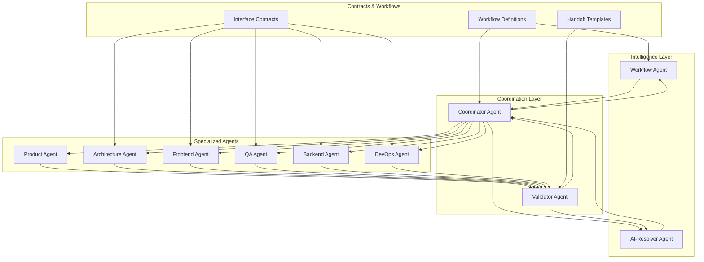

# 📋 Multi-Agent System Index

## 🎯 Agent Overview

| Agent | Version | Role | Primary Focus | Status |
|-------|---------|------|---------------|--------|
| **product** | 1.0.0 | Product Owner | User Stories, Requirements, Prioritization | 🆕 New |
| **arq** | 2.0.0 | Arquitecto de Software | Architecture, ADRs, Technical Constraints | ✅ Enhanced |
| **front** | 2.0.0 | Diseñador Frontend | UI/UX, Design System, Accessibility | ✅ Enhanced |
| **qa** | 2.0.0 | QA Engineer | Testing Strategy, Quality Gates | ✅ Enhanced |
| **backend** | 1.0.0 | Backend Engineer | API Design, Data Modeling, Services | 🆕 New |
| **coord** | 1.0.0 | Technical Lead | Workflow Orchestration, Conflict Resolution | 🆕 New |
| **devops** | 1.0.0 | Platform Engineer | CI/CD, Infrastructure, Monitoring | 🆕 New |
| **validator** | 1.0.0 | Integration Validator | Cross-Agent Validation, Quality Gates | 🆕 New |
| **workflow** | 1.0.0 | Workflow Intelligence | Auto-detect Optimal Workflow Type | 🚀 Latest |
| **ai-resolver** | 1.0.0 | AI Conflict Resolution | ML-Powered Conflict Resolution | 🚀 Latest |

## 🔄 System Architecture



## 📁 File Structure

```
.claude/agents/               # 🤖 EXECUTABLE AGENTS
├── README.md                 # Quick reference
├── product.md               # Product Owner Agent (New v1.0)
├── arq.md                   # Architecture Agent (Enhanced v2.0)
├── front.md                 # Frontend Agent (Enhanced v2.0)  
├── qa.md                    # QA Agent (Enhanced v2.0)
├── backend.md               # Backend Agent (New v1.0)
├── coord.md                 # Coordinator Agent (New)
├── devops.md                # DevOps Agent (New)
├── validator.md             # Validator Agent (New)
├── workflow.md              # Workflow Intelligence Agent (Latest v1.0)
└── ai-resolver.md           # AI Conflict Resolution Agent (Latest v1.0)

Documentacion Agentes/       # 📚 SYSTEM DOCUMENTATION
├── README.md                # This system overview
├── contracts.md             # Interface Contracts
├── workflows.md             # Workflow Definitions
├── execution-mechanics.md   # How the system really works
├── implementation-guide.md  # Usage Guidelines
└── usage-guide.md           # Usage Examples
```

## 🚀 Quick Start Guide

### 1. Product Requirements Definition
```bash
# Use product agent for user stories and requirements
@product: define user stories for the new blog commenting system
```

### 2. Architecture Analysis
```bash
# Use arq agent for architectural decisions
@arq: analyze the current React project architecture
```

### 3. Frontend Design Review  
```bash
# Use front agent for UI/UX analysis
@front: review the current design system and propose improvements
```

### 4. Quality Assessment
```bash
# Use qa agent for testing strategy
@qa: create a comprehensive test plan for the current features
```

### 5. Workflow Orchestration
```bash
# Use coord agent to manage multi-agent workflows
@coord: orchestrate a workflow for implementing new authentication system
```

### 6. Cross-Validation
```bash
# Use validator agent to check consistency
@validator: validate outputs from product, arq, front, and qa agents
```

### 7. Intelligent Workflow Detection
```bash
# Use workflow agent to auto-detect optimal workflow type
@workflow: analyze change impact and recommend workflow strategy
```

### 8. AI-Powered Conflict Resolution
```bash
# Use ai-resolver for complex conflict resolution
@ai-resolver: resolve conflicts between architecture and UX recommendations
```

## 🔧 Configuration

### Agent Selection Guide

| Use Case | Recommended Agent | Secondary Agents |
|----------|-------------------|------------------|
| **Product Requirements** | product | coord (prioritization) |
| **New Feature Planning** | coord → product → arq → front → qa | devops, validator |
| **Architecture Review** | arq | validator |
| **UI/UX Improvements** | front | arq (constraints), qa (testing) |
| **Testing Strategy** | qa | arq (requirements), front (UI specs) |
| **Infrastructure Changes** | devops | arq (constraints), qa (quality gates) |
| **Quality Assurance** | validator | All relevant agents |
| **Conflict Resolution** | coord | Conflicting agents |

### Workflow Types

1. **Sequential Workflow** → Use for: Architecture changes, breaking changes
2. **Parallel Workflow** → Use for: Independent features, UI-only changes  
3. **Iterative Workflow** → Use for: Complex features, experimental work

## 📊 Quality Gates

### System-Level Quality Gates
- [ ] All agent outputs follow defined contracts
- [ ] Cross-agent validation passes
- [ ] No unresolved conflicts between agents
- [ ] Implementation roadmap is coherent
- [ ] Quality metrics meet thresholds

### Agent-Specific Quality Gates
- **arq**: ADRs complete, technical constraints defined
- **front**: UI specifications complete, accessibility validated
- **qa**: Test strategy covers all requirements, quality gates defined
- **devops**: Infrastructure ready, CI/CD configured
- **coord**: Workflow orchestrated, conflicts resolved
- **validator**: Cross-validation passed, consistency verified

## 🔄 Handoff Process

### Standard Handoff Sequence
1. **Requirements** → coord (assessment)
2. **coord** → arq (architecture)
3. **arq** → front (UI constraints)
4. **front** → qa (testing specs)
5. **qa** → devops (quality gates)
6. **All agents** → validator (validation)
7. **validator** → coord (final approval)

### Handoff Templates
Each agent-to-agent handoff follows standardized templates defined in `contracts.md`:
- **arq → front**: Technical constraints, performance budgets
- **front → qa**: UI testing criteria, accessibility requirements
- **qa → devops**: CI/CD integration, quality thresholds
- **All → validator**: Cross-validation checklist

## 📈 Metrics & Monitoring

### Performance Metrics
- **Workflow Duration**: Target vs actual completion time
- **Agent Utilization**: Resource usage per agent
- **Quality Gate Pass Rate**: First-time pass percentage
- **Conflict Resolution Time**: Time to resolve conflicts

### Quality Metrics
- **Output Completeness**: Required deliverables completed
- **Cross-Agent Consistency**: Validation success rate  
- **Implementation Success**: Outputs successfully implemented
- **Stakeholder Satisfaction**: Feedback on deliverables

## 🛠️ Troubleshooting

### Common Issues

1. **Agent Conflicts**
   - Use validator agent to identify inconsistencies
   - Escalate to coordinator for resolution
   - Document resolution for future reference

2. **Missing Dependencies**
   - Check contracts.md for required inputs
   - Ensure prerequisite agents have completed outputs
   - Use coord agent to orchestrate proper sequence

3. **Quality Gate Failures**
   - Review agent-specific quality criteria
   - Use validator agent to identify specific failures
   - Iterate with relevant agents to resolve issues

### Best Practices

1. **Always start with coord agent** for complex workflows
2. **Use validator agent** before implementation
3. **Follow contracts** for agent interactions
4. **Document decisions** and rationale
5. **Iterate when necessary** rather than forcing solutions

## 🔮 Roadmap

### Phase 1 ✅ (Completed)
- Core agents enhanced (arq, front, qa)
- Coordination and validation agents added
- Interface contracts defined
- Basic workflow system implemented

### Phase 2 ✅ (Completed)
- Intelligent workflow detection agent
- AI-powered conflict resolution agent
- ML-based pattern analysis and optimization
- Advanced workflow automation

### Phase 3 🔄 (In Progress)
- Performance and security agents
- Real-time dashboard with agent metrics
- Predictive quality assessment
- Advanced reporting and analytics

### Phase 4 📅 (Planned)
- Integration with external tools
- Advanced monitoring and alerting
- Automated workflow optimization refinements
- Cross-project learning and patterns

---

## 📞 Support

For questions about the multi-agent system:
1. Check this README for overview
2. Review specific agent documentation
3. Consult contracts.md for interface details
4. Use coord agent for workflow guidance
5. Use validator agent for quality assurance

**System Version**: 2.2.0  
**Last Updated**: 2025-08-25  
**Maintained by**: Multi-Agent Architecture Team  
**Latest Features**: Workflow Intelligence + AI-Powered Conflict Resolution
