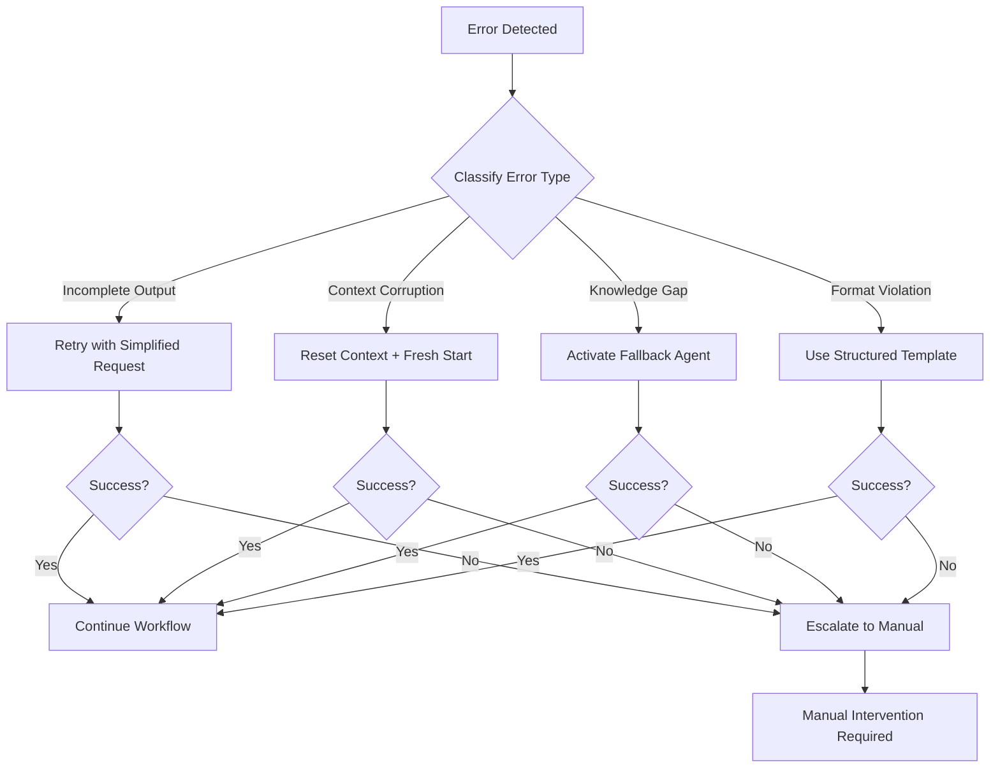

# 🤖 Sistema de Ejecución Multi-Agente: Cómo Funciona Realmente

## 🚨 **Aclaración Importante**

> **El Coordinator NO ejecuta otros agentes automáticamente.** Es un **strategic planner** que requiere ejecución manual de cada agente.

---

## 📋 **Realidad vs Expectativa**

### ❌ **Expectativa Incorrecta (Lo que NO sucede)**
```bash
# Muchos usuarios esperan esto:
@coord: implementa sistema de autenticación

# Y esperan que automáticamente se ejecute:
├── @arq: diseña arquitectura JWT
├── @front: crea UI de login  
├── @qa: define test strategy
└── @devops: configura deployment

# ❌ ESTO NO SUCEDE AUTOMÁTICAMENTE
```

### ✅ **Realidad Actual (Lo que SÍ sucede)**
```bash
# 1. Coordinator genera PLAN estratégico
@coord: implementa sistema de autenticación

# Output: Plan detallado con roadmap
# 2. Usuario ejecuta MANUALMENTE cada paso:
@arq: [comando específico basado en plan]
@front: [comando específico usando outputs de arq]
@qa: [comando específico usando outputs previos]
@devops: [comando específico usando todos los outputs]
```

---

## 🔧 **Mecánica Técnica Actual**

### **Limitaciones de la Plataforma Claude**
1. **No hay auto-ejecución entre agentes**
   - Cada `@agente` es una conversación independiente
   - No existe API para "llamar" otros agentes programáticamente
   - Cada agente requiere trigger manual del usuario

2. **Context Isolation**
   - Agentes no comparten memoria automáticamente
   - Outputs deben transferirse manualmente
   - No hay state persistente entre agentes

3. **Human-in-the-Loop Design**
   - Cada step requiere approval humano
   - Permite cambios de dirección mid-workflow
   - Quality gates manuales en cada fase

---

## 🎯 **Rol Real del Coordinator**

### **Coordinator = Technical Lead/Project Manager**

El coordinator funciona como un **strategic planner** que:

#### ✅ **LO QUE SÍ HACE:**
- **Analiza requirements** y define strategy
- **Selecciona workflow type** (sequential/parallel/iterative)
- **Identifica agentes necesarios** y orden de ejecución
- **Mapea dependencies** entre agentes
- **Define handoffs** y validation points
- **Crea roadmap detallado** con comandos específicos
- **Resuelve conflicts** entre outputs de agentes
- **Consolida results** finales

#### ❌ **LO QUE NO HACE:**
- **No ejecuta otros agentes** automáticamente
- **No pasa context** automáticamente entre agentes
- **No toma decisiones técnicas** específicas de dominio
- **No modifica outputs** de otros agentes directamente

---

## 🔄 **Patterns de Ejecución Real**

### **1. Sequential Workflow Pattern**
```mermaid
graph TD
    USER[Usuario] --> COORD[1. @coord: planifica feature]
    COORD --> PLAN[Plan estratégico generado]
    
    PLAN --> USER1[2. Usuario ejecuta]
    USER1 --> ARQ[@arq: comando específico]
    ARQ --> OUT1[Output arquitectura]
    
    OUT1 --> USER2[3. Usuario ejecuta]
    USER2 --> FRONT[@front: comando con context arq]
    FRONT --> OUT2[Output frontend]
    
    OUT2 --> USER3[4. Usuario ejecuta]
    USER3 --> QA[@qa: comando con context previo]
    QA --> OUT3[Output QA]
    
    OUT3 --> USER4[5. Usuario ejecuta]
    USER4 --> DEVOPS[@devops: comando final]
    DEVOPS --> OUT4[Output DevOps]
    
    OUT4 --> FINAL[Implementación lista]
```

### **Ejemplo Práctico Sequential:**
```bash
# Paso 1: Strategic Planning
@coord: planifica implementación de chat real-time

# Output del Coordinator:
"""
## Integration Roadmap
### Fase 1: Architecture (Día 1-2)
**Comando**: @arq: diseña arquitectura WebSocket para chat real-time con autenticación JWT
**Inputs**: Requirements de real-time messaging
**Outputs**: ADR WebSocket, API contracts, security patterns

### Fase 2: Frontend (Día 3-4)  
**Comando**: @front: diseña UI de chat basándote en la arquitectura WebSocket definida por arq
**Inputs**: ADR WebSocket, constraints técnicos
**Outputs**: Chat UI wireframes, design system components

### Fase 3: QA (Día 5)
**Comando**: @qa: define testing strategy para chat real-time usando outputs de arq y front
**Inputs**: Architecture decisions, UI specifications  
**Outputs**: Real-time testing plan, performance test cases

### Fase 4: DevOps (Día 6-7)
**Comando**: @devops: configura infrastructure para WebSocket deployment según plan completo
**Inputs**: Architecture + UI + Testing requirements
**Outputs**: Infrastructure setup, monitoring, deployment pipeline
"""

# Pasos 2-5: Usuario ejecuta manualmente cada comando
@arq: diseña arquitectura WebSocket para chat real-time con autenticación JWT

@front: diseña UI de chat basándote en la arquitectura WebSocket definida por arq

@qa: define testing strategy para chat real-time usando outputs de arq y front

@devops: configura infrastructure para WebSocket deployment según plan completo
```

### **2. Parallel Workflow Pattern**
```mermaid
graph TD
    USER[Usuario] --> COORD[1. @coord: organiza mejoras paralelas]
    COORD --> PLAN[Plan de ejecución paralela]
    
    PLAN --> SPLIT[2. Usuario ejecuta en paralelo]
    SPLIT --> ARQ[@arq: task A]
    SPLIT --> FRONT[@front: task B]
    SPLIT --> QA[@qa: task C]
    
    ARQ --> SYNC[3. Sincronización manual]
    FRONT --> SYNC
    QA --> SYNC
    
    SYNC --> COORD2[4. @coord: consolida outputs]
    COORD2 --> FINAL[Plan de integración final]
```

### **Ejemplo Práctico Parallel:**
```bash
# Paso 1: Planning paralelo
@coord: organiza optimización de performance en múltiples áreas

# Output: Plan de ejecución paralela
"""
## Parallel Execution Plan
Ejecutar simultáneamente:

**Task A**: @arq: analiza performance bottlenecks en architecture y APIs
**Task B**: @front: optimiza bundle size y rendering performance  
**Task C**: @qa: define performance testing benchmarks y métricas

Después sincronizar con: @coord: consolida optimization outputs
"""

# Pasos 2-4: Usuario ejecuta en paralelo
@arq: analiza performance bottlenecks en architecture y APIs &
@front: optimiza bundle size y rendering performance &  
@qa: define performance testing benchmarks y métricas

# Paso 5: Consolidación
@coord: consolida outputs de performance optimization y define roadmap de implementación
```

---

## ⚡ **Workflow Optimizado Recomendado**

### **Best Practice Pattern para Eficiencia Máxima**

#### **1. Strategic Planning Comprensivo**
```bash
@coord: [comprehensive planning request]
# Incluye: scope completo, constraints, timeline, resources
```

#### **2. Context Preparation Batch**
```bash
# Prepara contexto completo desde el inicio
@arq: basándote en el plan detallado de coord, [specific architecture task]
```

#### **3. Context Forwarding Explícito** 
```bash
# Reference outputs previos explícitamente
@front: usando las decisiones arquitectónicas de arq sobre [specific topic], diseña [UI task]

@qa: considerando la arquitectura de arq y diseño de front, define [testing strategy]
```

#### **4. Parallel Execution Where Possible**
```bash
# Cuando tasks son independientes
@qa: [independent task A] &
@devops: [independent task B]
# Ambos usando context consolidado
```

#### **5. Final Integration**
```bash
@coord: consolida todos los outputs (arq + front + qa + devops) y genera implementation roadmap final
```

---

## 💡 **Ventajas y Desventajas del Sistema Actual**

### ✅ **Ventajas del Manual Execution**
1. **Human Oversight**: Control de calidad en cada step
2. **Flexibility**: Cambiar dirección based on intermediate results
3. **Cost Optimization**: No ejecuta agentes unnecessarily
4. **Quality Gates**: Review manual en cada handoff
5. **Context Awareness**: Usuario mantiene big picture
6. **Error Recovery**: Fácil rollback o correction en cualquier punto

### ⚠️ **Desventajas del Manual Execution**
1. **More Time Consuming**: Requiere multiple interactions
2. **Context Management**: Usuario debe mantener context entre steps
3. **Risk de Context Loss**: Información se puede perder entre agentes
4. **Manual Coordination**: Usuario actúa como "message passing system"
5. **Potential Inconsistencies**: Si context no se pasa correctamente

---

## 🔮 **Evolución Futura Hipotética**

### **Sistema Auto-Executor (No disponible actualmente)**
```typescript
// Hipotético futuro system
interface AutoOrchestration {
  plan: WorkflowPlan
  executeSequential(agents: Agent[]): Promise<AgentOutputs[]>
  executeParallel(agents: Agent[]): Promise<AgentOutputs[]>
  handleConflicts(): ConflictResolution
  validateIntegration(): ValidationResult
  passContext(from: Agent, to: Agent): ContextTransfer
}

// Esto NO existe, pero sería ideal:
@coord: auto-execute auth implementation
// → Automatic: arq → front → qa → devops con context passing automático
```

### **Características del Sistema Ideal**
- **Auto-execution** de agent sequences
- **Context passing** automático entre agentes
- **Conflict resolution** automática con fallback a human
- **Quality gates** automáticos con validation
- **Progress tracking** y status reporting
- **Error handling** y retry mechanisms

---

## 📊 **Comparison: Manual vs Auto-Execution**

| Aspecto | Sistema Actual (Manual) | Sistema Ideal (Auto) |
|---------|-------------------------|----------------------|
| **Control** | ✅ Total human control | ⚠️ Limited human control |
| **Speed** | ❌ Slower execution | ✅ Faster execution |
| **Quality** | ✅ Manual quality gates | ⚠️ Automated quality (risk) |
| **Flexibility** | ✅ High adaptability | ❌ Less adaptable |
| **Cost** | ✅ Optimized usage | ❌ Higher token consumption |
| **Error Handling** | ✅ Easy human intervention | ⚠️ Automated recovery needed |
| **Learning Curve** | ⚠️ Requires understanding | ✅ Easier to use |

---

## 🎯 **Guía Práctica de Uso**

### **Para Maximizar Eficiencia con Sistema Actual**

#### **1. Planning Phase - Detailed Coordinator**
```bash
@coord: crea plan detallado para implementar [feature compleja] incluyendo:
- Workflow type selection
- Agent sequence con dependencies
- Comandos específicos para cada agente
- Handoff requirements entre agentes
- Timeline y checkpoints
- Context que debe pasarse entre steps
```

#### **2. Execution Phase - Follow the Plan**
```bash
# Copy-paste comandos del coordinator plan
# Include context references explícitamente
@arq: [comando exacto del plan coordinator]

@front: basándote en [specific output de arq], [comando del plan]

@qa: usando outputs de arq sobre [topic] y front sobre [topic], [comando del plan]
```

#### **3. Context Management**
```bash
# Always reference previous outputs
@agent: considerando las decisiones previas de [previous agent] sobre [specific topic]...

# Include relevant context explicitly
@agent: usando el ADR de [topic] y wireframes de [feature]...
```

#### **4. Quality Gates**
```bash
# Use coordinator para validation intermedia
@coord: valida coherencia entre outputs de arq y front antes de continuar

# Use validator para cross-checking
@validator: verifica consistency entre [agent A] y [agent B] outputs
```

#### **5. Final Integration**
```bash
@coord: consolida todos los outputs finales y crea implementation roadmap ready para development team
```

---

## 🚨 **Common Pitfalls y Cómo Evitarlos**

### **❌ Pitfall 1: Expectativa de Auto-Execution**
```bash
# ❌ Error común
@coord: implementa feature X
# Usuario espera que coordinator haga todo automáticamente

# ✅ Approach correcto  
@coord: planifica implementación de feature X con roadmap detallado
# Después ejecutar plan manualmente step by step
```

### **❌ Pitfall 2: Context Loss**
```bash
# ❌ Context perdido
@arq: diseña architecture
@front: diseña UI  # Sin reference a arq output

# ✅ Context maintained
@arq: diseña architecture para auth system
@front: basándote en la arquitectura JWT de arq, diseña UI de login
```

### **❌ Pitfall 3: Skipping Coordination**
```bash
# ❌ Sin coordinación
@arq: task A
@front: task B  
@qa: task C
# Posibles conflicts y inconsistencies

# ✅ Con coordinación
@coord: organiza tasks A, B, C con dependencies
# Después ejecutar según plan
```

---

## 📋 **Checklist para Execution Exitosa**

### **Pre-Execution**
- [ ] ¿Usé coordinator para planning detallado?
- [ ] ¿Tengo roadmap claro con comandos específicos?
- [ ] ¿Entiendo dependencies entre agentes?
- [ ] ¿Tengo timeline y checkpoints definidos?

### **During Execution**
- [ ] ¿Estoy siguiendo la secuencia planificada?
- [ ] ¿Estoy pasando context entre agentes explícitamente?
- [ ] ¿Estoy referencing outputs previos correctamente?
- [ ] ¿Estoy validating coherencia en checkpoints?

### **Post-Execution**
- [ ] ¿Usé coordinator para consolidation final?
- [ ] ¿Validé consistency entre todos los outputs?
- [ ] ¿Tengo implementation roadmap completo?
- [ ] ¿Documenté lessons learned para future workflows?

---

## 🎯 **Resumen Ejecutivo**

### **Key Takeaways**
1. **Coordinator = Strategic Planner**, no auto-executor
2. **Manual execution** requerida para cada agente
3. **Context passing** es responsabilidad del usuario
4. **Quality gates** manuales en cada step
5. **Planning detallado** es crítico para éxito
6. **Follow the roadmap** sistemáticamente

### **Success Formula**
```
Detailed Coordinator Planning + 
Manual Step-by-Step Execution + 
Explicit Context Passing + 
Quality Validation = 
Successful Multi-Agent Workflow
```

---

## 🚨 **Sistema de Manejo de Errores y Recuperación**

### **Tipos de Errores en Sistema Multi-Agente**

#### **1. Agent Execution Errors**
**Síntomas:**
- Agente no responde o genera output incompleto
- Respuestas que no siguen el formato esperado
- Timeout en ejecución de comandos complejos
- Context corruption o pérdida de información

**Causes Comunes:**
```bash
# Context overload
@coord: implementa sistema complejo + migración + optimization + security
# ❌ Demasiado scope, agente se sobrecarga

# Comando ambiguo
@arq: mejora la aplicación
# ❌ Sin especificity, genera respuestas vagas

# Missing critical context
@front: diseña login UI
# ❌ Sin conocimiento de architecture decisions previas
```

#### **2. Context Transfer Failures**
**Síntomas:**
- Inconsistencias entre outputs de agentes secuenciales
- Información crítica perdida entre handoffs
- Decisiones conflictivas no detectadas
- Duplication de trabajo entre agentes

#### **3. Workflow Coordination Errors**
**Síntomas:**
- Agentes ejecutados en orden incorrecto
- Dependencies no satisfechas
- Circular dependencies entre agentes
- Deadlocks en parallel workflows

#### **4. Quality Gate Failures**
**Síntomas:**
- Outputs que no cumplen estándares mínimos
- Deliverables incompletos o incorrectos
- Conflictos no resueltos entre agentes
- Implementation blockers no identificados

---

### **🔄 Circuit Breaker Patterns para Agent Failures**

#### **Circuit Breaker Estados**

```mermaid
stateDiagram-v2
    [*] --> Closed
    
    Closed --> Open : failure_threshold_exceeded
    Open --> HalfOpen : timeout_period_elapsed
    HalfOpen --> Closed : success_detected
    HalfOpen --> Open : failure_detected
    
    note right of Closed : Normal operation\nAgent responding correctly
    note right of Open : Agent failed multiple times\nActivate fallback strategy
    note right of HalfOpen : Test if agent recovered\nLimited retry attempts
```



#### **Failure Thresholds por Agent**

```yaml
circuit_breaker_config:
  coordinator:
    failure_threshold: 3
    timeout_period: "10 minutes"
    recovery_test_commands: ["simple planning task"]
  
  architecture:
    failure_threshold: 2
    timeout_period: "5 minutes" 
    recovery_test_commands: ["basic architecture review"]
  
  frontend:
    failure_threshold: 2
    timeout_period: "5 minutes"
    recovery_test_commands: ["simple UI review"]
  
  qa:
    failure_threshold: 3
    timeout_period: "5 minutes"
    recovery_test_commands: ["basic test case review"]
    
  devops:
    failure_threshold: 2
    timeout_period: "10 minutes"
    recovery_test_commands: ["config review"]
```

#### **Circuit Breaker Implementation**

**Estado CLOSED (Normal Operation)**
```bash
# ✅ Agent funcionando normalmente
@arq: evalúa arquitectura actual del proyecto React
# Respuesta completa y coherente dentro de timeframe esperado
```

**Estado OPEN (Agent Degraded)**
```bash
# ❌ Agent falló múltiples veces, circuit breaker OPEN
@arq: evalúa arquitectura actual del proyecto React
# Sistema detecta pattern de fallas

# ✅ Auto-activación de fallback strategy
# Fallback 1: Usar agente alternativo
@coord: básate en principles generales de React architecture para hacer evaluation

# Fallback 2: Simplificar request
@arq: lista solo los componentes arquitectónicos principales

# Fallback 3: Manual override mode
# Usuario toma decisión manual basada en documentation interna
```

**Estado HALF-OPEN (Testing Recovery)**
```bash
# 🔍 Test recovery con comando simple
@arq: confirma que puedes acceder a knowledge base sobre React patterns
# Si responde correctamente → Circuit closes
# Si falla nuevamente → Circuit opens
```

---

### **🛡️ Fallback Strategies Jerárquicas**

#### **Strategy Level 1: Agent Substitution**

```yaml
primary_agent_fallbacks:
  arq: 
    - coordinator (architecture planning mode)
    - validator (technical validation mode)
  
  front:
    - coordinator (UI planning mode)
    - arq (frontend architectural constraints)
  
  qa:
    - coordinator (quality planning mode)
    - validator (quality validation mode)
  
  devops:
    - coordinator (infrastructure planning mode)
    - arq (deployment architecture mode)
  
  coordinator:
    - workflow (workflow intelligence mode)
    - manual_orchestration (user-guided mode)
```

**Ejemplo Practical:**
```bash
# Primary agent fails
@arq: [fails to respond coherently]

# Auto-fallback to coordinator in architecture mode
@coord: actúa como architecture consultant y evalúa la estructura React actual usando FSD principles

# Si coordinator también falla, fallback manual
# Usuario consulta documentation y toma decisión manual
```

#### **Strategy Level 2: Request Simplification**

**Progressive Request Degradation:**
```bash
# Original complex request
@front: diseña sistema completo de theming con dark mode, custom branding, y responsive design

# Level 1 Simplification
@front: diseña implementación básica de dark mode toggle

# Level 2 Simplification  
@front: lista requirements técnicos para implementar theme switching

# Level 3 Simplification
@front: confirma que PrimeReact soporta theming dinámico

# Level 4 Manual Fallback
# Usuario investiga PrimeReact theming documentation manualmente
```

#### **Strategy Level 3: Context Reduction**

**Context Overload Recovery:**
```bash
# Agente sobrecargado con context
@coord: [context de 50+ decisiones previas] + planifica nueva feature compleja
# ❌ Context overflow, respuesta incoherente

# Fallback: Context segmentation
@coord: enfocándote únicamente en [specific subsystem], planifica [limited scope task]

# Fallback: Fresh context start
@coord: sin considerar historial previo, evalúa [task] desde zero

# Fallback: Manual context curation
# Usuario selecciona solo el context crítico más relevante
```

#### **Strategy Level 4: Workflow Decomposition**

```bash
# Original complex workflow fails
@coord: implementa authentication + authorization + audit logging + compliance
# ❌ Too complex, generates inconsistent plan

# Decompose into sequential simple workflows
@coord: planifica únicamente implementation de basic authentication

# After success, continue with next component
@coord: basándote en authentication implementation, planifica authorization layer

# Continue systematically
@coord: usando auth + authz foundation, planifica audit logging
```

---

### **⚡ Error Recovery Workflows**

#### **Automatic Error Detection**

**Error Signatures por Agent:**
```yaml
error_detection_patterns:
  incomplete_output:
    - response_length: < 100_characters
    - missing_sections: ["analysis", "recommendations", "implementation"]
    - generic_responses: ["I understand", "Let me help", "Sure"]
  
  context_corruption:
    - references_wrong_project: true
    - mentions_non_existent_features: true
    - contradicts_previous_outputs: true
  
  knowledge_gaps:
    - disclaimers: > 3
    - uncertainty_phrases: ["I'm not sure", "Maybe", "It depends"]
    - requests_for_clarification: > 2
  
  format_violations:
    - missing_required_sections: true
    - incorrect_markdown_structure: true
    - no_actionable_recommendations: true
```

#### **Recovery Workflow Automático**



#### **Manual Intervention Triggers**

**Escalation Criteria:**
- 3+ consecutive agent failures
- Circuit breaker OPEN en agente crítico
- Conflictos irresolvables entre 2+ agentes
- Quality gates failing en 50%+ de outputs
- Critical path blocker sin fallback disponible

**Manual Intervention Process:**
```bash
# 1. Error Assessment
# Usuario evalúa root cause del failure pattern

# 2. Context Audit
# Review completo del context pasado a agentes

# 3. Strategy Adjustment
# Modificación de approach basada en lessons learned

# 4. Recovery Implementation
# Execute manual workaround o alternative approach

# 5. System Update
# Update de fallback strategies basado en experience
```

---

### **🔧 Degradation Graceful Guidelines**

#### **Graceful Degradation Levels**

**Level 1: Reduced Functionality**
```bash
# En lugar de comprehensive analysis
@arq: list top 3 architectural concerns únicamente

# En lugar de complete UI design
@front: provide wireframe sketches únicamente

# En lugar de full test strategy  
@qa: identify critical test cases únicamente
```

**Level 2: Essential Functions Only**
```bash
# Focus en core requirements únicamente
@arq: validate que architecture soporta basic user auth

# Minimal viable outputs
@front: confirm que UI framework puede handle basic CRUD

# Basic quality assurance
@qa: verify que happy path está covered
```

**Level 3: Advisory Mode**
```bash
# Agentes actúan como advisors, no executors
@arq: provide general React architecture guidance

@front: suggest PrimeReact components que podrían ser useful

@qa: recommend testing frameworks apropiados para React
```

**Level 4: Documentation Mode**
```bash
# Agentes referencian documentation existente
@arq: point to React official documentation sobre performance best practices

@front: reference PrimeReact documentation sobre theming

@qa: link to Jest documentation sobre testing React components
```

#### **Quality Threshold Management**

**Dynamic Quality Thresholds:**
```yaml
quality_thresholds:
  normal_operation:
    completeness: 95%
    accuracy: 98%
    consistency: 99%
    actionability: 90%
  
  degraded_mode_level_1:
    completeness: 80%
    accuracy: 95%
    consistency: 95%
    actionability: 75%
  
  degraded_mode_level_2:
    completeness: 60%
    accuracy: 90%
    consistency: 90%
    actionability: 60%
  
  emergency_mode:
    completeness: 40%
    accuracy: 85%
    consistency: 80%
    actionability: 50%
```

#### **User Communication Durante Degradation**

**Transparency Messaging:**
```bash
# Auto-generated status messages
🚨 AGENT STATUS: @arq circuit breaker OPEN - using coordinator fallback
⚠️  DEGRADED MODE: Reduced analysis depth due to agent availability
💡 RECOMMENDATION: Retry @arq command in 10 minutes
📚 ALTERNATIVE: Consult architecture documentation manually

# Progress indicators
🔄 RECOVERY ATTEMPT: Testing @arq functionality (attempt 2/3)
✅ RECOVERED: @arq circuit breaker CLOSED - full functionality restored
```

---

### **📊 Error Monitoring y Analytics**

#### **Key Metrics Tracking**

**Agent Health Metrics:**
```yaml
monitoring_metrics:
  agent_availability:
    - uptime_percentage
    - response_time_p95
    - success_rate_24h
    - error_rate_trend
  
  circuit_breaker_stats:
    - times_opened_per_day
    - recovery_time_average
    - fallback_activation_count
    - manual_intervention_frequency
  
  workflow_health:
    - completion_rate
    - average_execution_time
    - quality_gate_pass_rate
    - user_satisfaction_score
```

**Alerting Thresholds:**
```bash
# Critical alerts
- Agent availability < 70% over 1 hour
- Circuit breaker open > 30 minutes
- Manual interventions > 5 per day
- Quality gate failures > 40% over 4 hours

# Warning alerts  
- Response time > 2x baseline
- Error rate trending upward > 20%
- Fallback usage > 30% of requests
- User satisfaction < 3.5/5
```

#### **Continuous Improvement Process**

**Weekly Error Analysis:**
```bash
# 1. Error pattern identification
# Review error logs para identificar recurring issues

# 2. Root cause analysis  
# Investigate underlying causes de agent failures

# 3. Fallback effectiveness review
# Evaluate success rate de fallback strategies

# 4. Circuit breaker tuning
# Adjust thresholds basado en performance data

# 5. Documentation updates
# Update guidelines basado en lessons learned
```

---

### **🎯 Error Prevention Best Practices**

#### **Request Optimization**

**Preventive Measures:**
```bash
# ✅ Clear, specific requests
@arq: evalúa React Router configuration en src/app/providers contra FSD best practices

# ✅ Appropriate context scope
@front: basándote en la arquitectura FSD definida, diseña login form component

# ✅ Progressive complexity
@qa: primero valida basic functionality tests, después integration tests

# ❌ Avoid overloading
@coord: implementa todo - auth + UI + tests + deployment + monitoring + analytics
```

#### **Context Management**

**Best Practices:**
```bash
# ✅ Context relevance filtering
@arq: considerando únicamente las decisiones de routing de coord, evalúa navigation architecture

# ✅ Context freshness validation  
@front: usando las UI requirements actualizadas (no el design de la semana pasada), diseña component

# ✅ Context dependency mapping
@qa: basándote específicamente en arq decisions sobre JWT + front designs sobre login form, define test cases
```

#### **Quality Assurance Integration**

**Proactive Quality Gates:**
```bash
# Before agent execution
- Validate request clarity y specificity
- Ensure necessary context está available
- Check agent availability status
- Confirm expected output format

# During execution
- Monitor response completeness en real-time
- Detect early signs de context corruption
- Track response time vs baseline
- Validate intermediate outputs

# After execution
- Cross-validate outputs con quality criteria
- Check consistency con previous agent outputs
- Verify actionability de recommendations
- Confirm no critical information missing
```

---

**Versión**: 2.0  
**Última actualización**: 2025-08-26  
**Próxima revisión**: Basada en user feedback, error analytics, y platform evolution  
**Changelog**: Agregado sistema completo de error handling, circuit breakers, y fallback strategies
