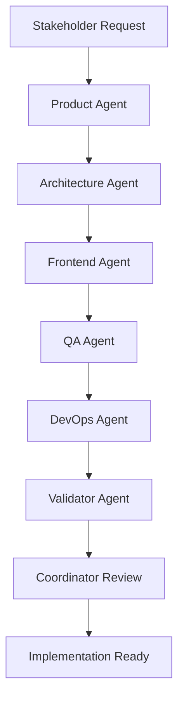
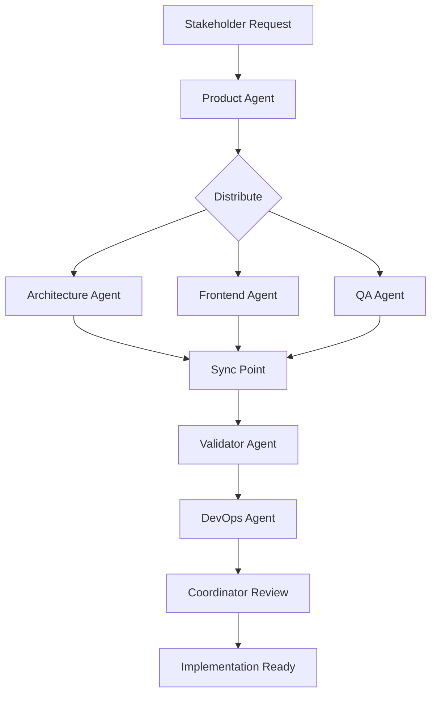
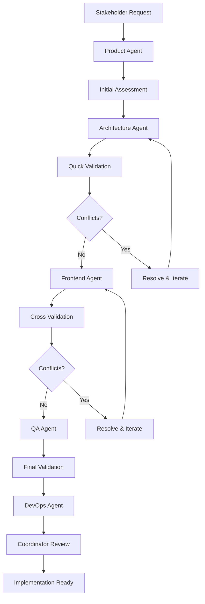

# 🚀 Multi-Agent Workflow System

## Workflow Definitions

### 🔄 Sequential Workflow
Para cambios que requieren definición clara de producto y dependencies estrictas:



**Trigger Conditions:**
- New feature requests from stakeholders
- Major product initiatives
- User experience improvements
- Business requirement changes

**Gates:**
- PRODUCT → ARQ: User stories and acceptance criteria defined
- ARQ → FRONT: Technical constraints defined
- FRONT → QA: UI specifications complete
- QA → DEVOPS: Quality gates established
- DEVOPS → VAL: Infrastructure ready
- VAL → COORD: All validations passed

### ⚡ Parallel Workflow
Para features independientes sin dependencies críticas:



**Trigger Conditions:**
- Independent feature development
- UI-only changes
- Test suite updates
- Documentation updates

**Sync Criteria:**
- All agents completed their outputs
- No cross-agent conflicts detected
- Dependencies satisfied

### 🔁 Iterative Workflow
Para development continuo con feedback loops:



**Trigger Conditions:**
- Complex features with uncertainty
- Experimental implementations
- High-risk changes
- Cross-team collaboration

## Workflow Orchestration

### 🎯 Coordinator Decision Matrix

| Scenario | Workflow Type | Trigger Agent | Critical Path |
|----------|---------------|---------------|---------------|
| **New Feature Request** | Sequential | product | product → arq → front → qa → devops |
| **New Architecture** | Sequential | arq | arq → front → qa → devops |
| **UI Redesign** | Parallel | front | front \|\| qa, then devops |
| **API Changes** | Sequential | arq | arq → qa → devops |
| **Performance Issue** | Iterative | arq | arq ↔ front ↔ devops |
| **Security Vulnerability** | Sequential | arq | arq → devops → qa |
| **Bug Fix** | Parallel | qa | qa \|\| front, then devops |
| **Infrastructure Change** | Sequential | devops | devops → arq → qa |
| **Feature Enhancement** | Iterative | coord | coord → product ↔ arq ↔ front ↔ qa |

### 📋 Quality Gates by Workflow

#### Sequential Gates
1. **Product Gate**: User stories complete, acceptance criteria defined
2. **Architecture Gate**: ADRs complete, constraints defined
3. **Design Gate**: UI specs aligned with architecture  
3. **Quality Gate**: Test strategy covers all requirements
4. **Infrastructure Gate**: Deployment strategy validated
5. **Integration Gate**: All outputs coherent and implementable

#### Parallel Gates
1. **Independence Gate**: No cross-agent dependencies detected
2. **Sync Gate**: All parallel outputs complete
3. **Consistency Gate**: No conflicts between parallel outputs
4. **Integration Gate**: Combined outputs implementable

#### Iterative Gates
1. **Assessment Gate**: Scope and complexity evaluated
2. **Iteration Gate**: Each cycle produces incremental value
3. **Convergence Gate**: Iterations converging to solution
4. **Completion Gate**: All requirements satisfied

## Trigger System

### 🔔 Event-Driven Triggers

```typescript
interface WorkflowTrigger {
  event: TriggerEvent
  condition: string
  targetWorkflow: WorkflowType
  priority: 'low' | 'medium' | 'high' | 'critical'
  agents: AgentName[]
  estimatedDuration: string
}

const triggers: WorkflowTrigger[] = [
  {
    event: 'architecture_change',
    condition: 'Major architectural decision required',
    targetWorkflow: 'sequential',
    priority: 'high',
    agents: ['arq', 'front', 'qa', 'devops'],
    estimatedDuration: '3-5 days'
  },
  {
    event: 'ui_enhancement', 
    condition: 'UI changes without architectural impact',
    targetWorkflow: 'parallel',
    priority: 'medium',
    agents: ['front', 'qa'],
    estimatedDuration: '1-2 days'
  },
  {
    event: 'complex_feature',
    condition: 'High uncertainty or cross-cutting concerns',
    targetWorkflow: 'iterative', 
    priority: 'high',
    agents: ['coord', 'arq', 'front', 'qa', 'devops'],
    estimatedDuration: '5-10 days'
  }
]
```

### ⚡ Automatic Workflow Selection

```typescript
function selectWorkflow(requirements: Requirements): WorkflowConfig {
  const complexity = assessComplexity(requirements)
  const dependencies = analyzeDependencies(requirements)
  const risk = calculateRisk(requirements)
  
  if (complexity === 'high' || risk === 'high') {
    return iterativeWorkflow
  }
  
  if (dependencies.length > 2) {
    return sequentialWorkflow  
  }
  
  return parallelWorkflow
}
```

## Escalation Procedures

### 🚨 Conflict Resolution

1. **Agent-Level Conflicts**
   - Validator detects inconsistency
   - Escalate to relevant agents for clarification
   - If unresolved → escalate to Coordinator

2. **Coordinator-Level Conflicts**
   - Coordinator cannot resolve technical conflict
   - Escalate to technical lead/architect
   - Document decision and rationale

3. **Timeline Conflicts**
   - Workflow exceeding estimated duration
   - Coordinator assesses scope reduction options
   - Stakeholder communication for priority adjustment

### 📊 Workflow Metrics

#### Performance Metrics
- **Workflow Duration**: Actual vs estimated completion time
- **Agent Utilization**: Time each agent spends per workflow
- **Conflict Rate**: Percentage of workflows with conflicts
- **Quality Gate Pass Rate**: First-time pass rate per gate

#### Quality Metrics  
- **Output Completeness**: Percentage of required deliverables completed
- **Cross-Agent Consistency**: Validation success rate
- **Implementation Success Rate**: Percentage of outputs successfully implemented
- **Stakeholder Satisfaction**: Feedback on deliverable quality

## Implementation Guidelines

### 🛠️ Workflow Execution

1. **Initialization**
   ```bash
   # Coordinator assesses requirements
   coord: analyze_requirements(requirements)
   coord: select_workflow(analysis)
   coord: initialize_workflow(agents, timeline)
   ```

2. **Execution**
   ```bash
   # Agents execute according to workflow type
   foreach agent in workflow.agents:
       agent.execute(inputs, constraints)
       validator.validate(agent.outputs)
   ```

3. **Completion**
   ```bash
   # Final validation and handoff
   validator: cross_validate(all_outputs)
   coord: assess_readiness(validation_results)
   coord: generate_implementation_plan(validated_outputs)
   ```

### 📝 Documentation Standards

Each workflow execution must produce:
- **Workflow Execution Log**: Timeline, decisions, conflicts
- **Agent Output Summary**: Key deliverables per agent
- **Validation Report**: Quality gates and validation results
- **Implementation Roadmap**: Next steps and dependencies
- **Lessons Learned**: Improvements for future workflows

This workflow system ensures:
- **Appropriate workflow** selection based on requirements
- **Clear quality gates** at each stage
- **Conflict resolution** procedures
- **Metrics and monitoring** for continuous improvement
- **Flexibility** to handle different types of changes
